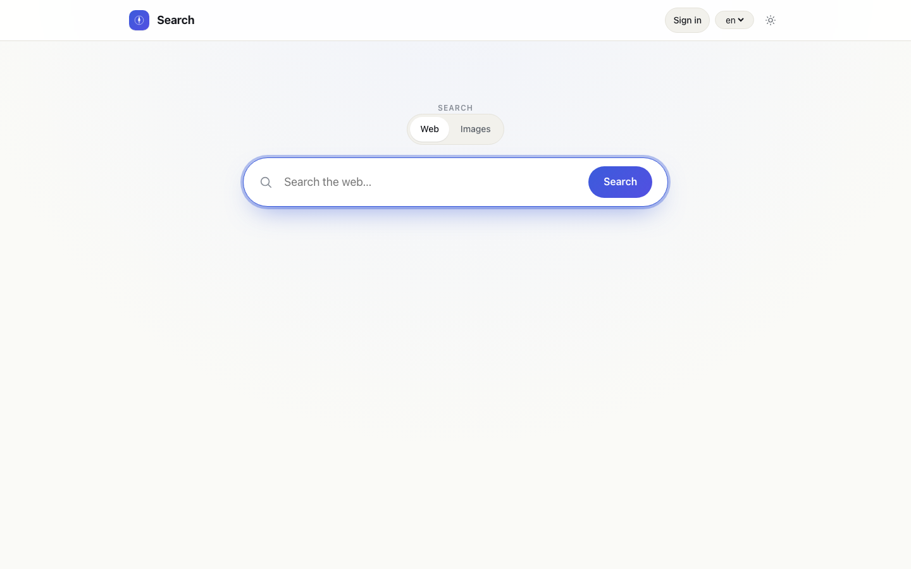
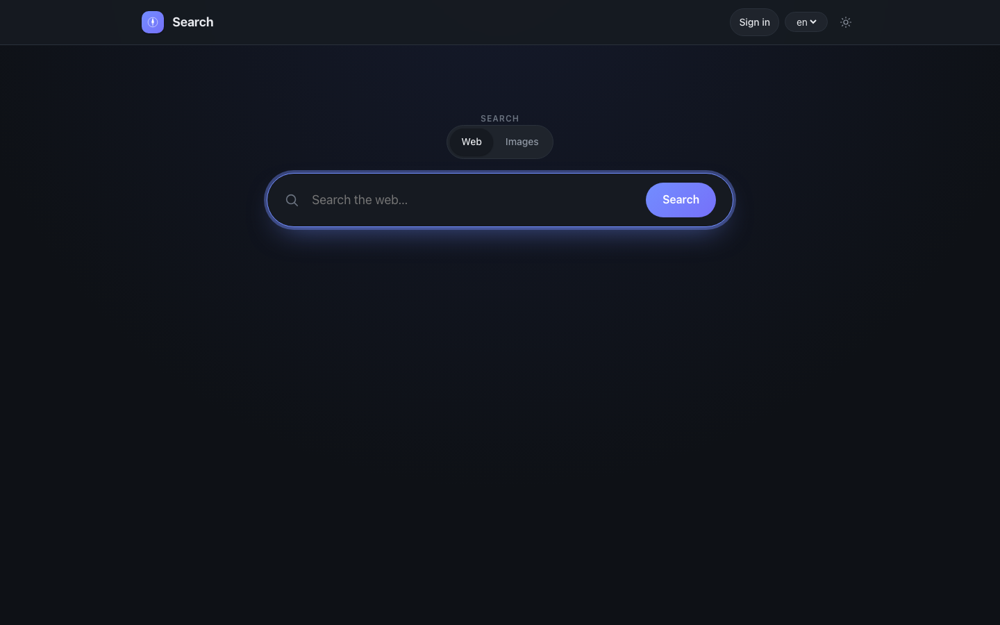
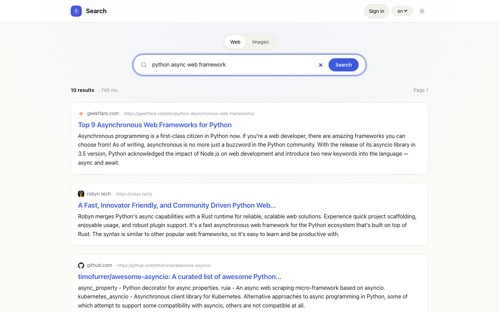
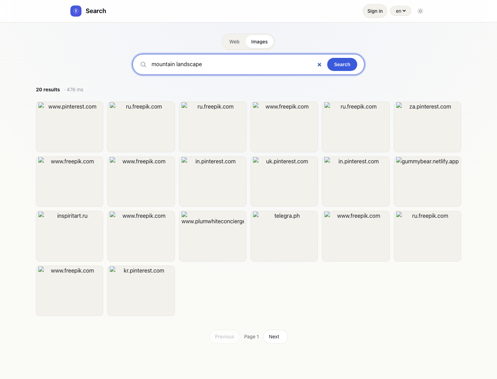

# simple-search

[](https://github.com/search-router/simple-search/actions/workflows/ci.yml)
[](LICENSE)
[](pyproject.toml)
[](https://docs.astral.sh/ruff/)
[](https://mypy-lang.org/)

A clean, RTL-ready metasearch service: one API and one UI in front of pluggable
search providers. Ships with an adapter for **Search Router** plus deterministic
mock backends that let the UI run beautifully without any API keys, and an
entry-point-based plugin system for dropping in your own adapters.

<p align="center">
  
  
</p>

## Features

- **Backend:** Python 3.12+, FastAPI, Pydantic v2, httpx, defusedxml.
- **Frontend:** Server-rendered Jinja2 with a small modern design system —
  light/dark, logical CSS properties, full RTL coverage for `ar`, `he`, `fa`,
  `ur` (and any other RTL tag you add).
- **Storage:** Optional Redis cache; degrades to a `NullCache` when Redis is
  not configured.
- **No keys required:** Missing credentials transparently swap real adapters
  for mock implementations, so `docker compose up` produces a fully working,
  beautiful demo out of the box.
- **Pluggable backends:** Drop in your own provider via the
  `search_service.backends` entry point — no fork required.
- **Production-minded:** Circuit breaker, structured JSON logging, security
  headers, CSRF, rate limiting, admin-token-gated health/introspection.

## Quick start

```bash
git clone https://github.com/search-router/simple-search.git
cd simple-search
cp .env.example .env
docker compose up --build
# open http://localhost:8000/
```

To run without Docker:

```bash
python -m venv .venv && source .venv/bin/activate
pip install -e ".[dev,redis]"
uvicorn app.main:app --reload
# open http://localhost:8000/
```

The home page works immediately (mock-backed). Set `SEARCH_ROUTER_API_KEY` in
`.env` to switch the Search Router adapter to its real upstream.

## Configuration

Configuration lives in `.env` (secrets and environment-level knobs) and
`config.yaml` (declarative backend wiring, feature flags). See
[`.env.example`](.env.example) for the full list with comments.

| Variable                | Required | Default       | Purpose                                                                 |
| ----------------------- | -------- | ------------- | ----------------------------------------------------------------------- |
| `APP_ENV`               | no       | `dev`         | `dev` or `prod`; tightens defaults in prod.                             |
| `APP_CONFIG_FILE`       | no       | `config.yaml` | Path to the declarative config file.                                    |
| `LOG_LEVEL`             | no       | `INFO`        | Standard Python logging levels.                                         |
| `SEARCH_ROUTER_API_KEY` | no       | _(empty)_     | Real Search Router credentials. Empty → adapter falls back to mock.     |
| `REDIS_URL`             | no       | _(empty)_     | Optional cache. Empty → `NullCache`.                                    |
| `ADMIN_TOKEN`           | prod     | _(empty)_     | Required to call `/api/v1/health` and `/api/v1/backends`.               |
| `SESSION_SECRET`        | prod     | _(empty)_     | Signs ads-cabinet session cookies. Empty in dev → ephemeral per-process. |

See [docs/deployment.md](docs/deployment.md) for the hardening checklist
before running with `APP_ENV=prod`.

## API

| Method | Path                       | Body                                               |
| ------ | -------------------------- | -------------------------------------------------- |
| POST   | `/api/v1/search/web`       | `{ q, backend, language, region, page, limit, … }` |
| POST   | `/api/v1/search/images`    | same shape + `image_filters`                       |
| GET    | `/api/v1/backends`         | introspection list                                 |
| GET    | `/api/v1/health`           | service + redis + per-backend status               |
| GET    | `/docs`                    | OpenAPI / Swagger UI                               |

Example:

```bash
curl -s http://localhost:8000/api/v1/search/web \
  -H 'Content-Type: application/json' \
  -d '{"q":"python async search","limit":5}' | jq
```

Full schema: [docs/api.md](docs/api.md).

## UI

- `GET /` — search hero, segmented Web / Images toggle, locale picker.
- `GET /search?q=…&type=web` — web results with breadcrumb cards, pagination.
- `GET /search?q=…&type=images` — image grid with `<dialog>`-based lightbox.
- Light/dark theme via `prefers-color-scheme` plus a manual toggle.
- Full RTL support: pass `?ui_locale=ar` (or `he`, `fa`, `ur`) and the entire
  layout mirrors automatically. Result text uses `dir="auto"` so mixed-script
  snippets (e.g. `python مكتبة البحث`) render correctly inside an RTL page.

<p align="center">
  
  
</p>

## Project layout

```
.
├── app/
│   ├── api/          FastAPI routers (v1)
│   ├── backends/     BaseBackend + search-router adapter + mocks
│   ├── core/         config, cache, circuit breaker, i18n, logging, security
│   ├── search/       schemas, registry, router, normalizer, ranking
│   ├── ads/          ads cabinet (auth, storage, auction)
│   ├── ui/           Jinja templates, static assets, translations
│   └── main.py       app factory
├── tests/
│   ├── unit/         schemas, normalizer, adapter, breaker, cache
│   ├── integration/  end-to-end API round-trips through mock backends
│   └── ui/           server-rendered template assertions (incl. RTL)
├── docs/             architecture, adapters, search-router, i18n, api, deployment
├── config.yaml       declarative backend and feature wiring
├── Dockerfile
└── docker-compose.yml
```

## Adding a new backend

See [docs/backend-adapters.md](docs/backend-adapters.md). In short:

1. Subclass `app.backends.base.BaseBackend`.
2. Implement `search_web`, `search_images`, plus `capabilities()`.
3. Either:
   - Register it in `config.yaml` under `search.backends.<name>` and add a
     factory entry in `app/search/registry.py`; or
   - Expose it via the `search_service.backends` entry point group from a
     separate Python distribution — the registry will pick it up automatically.

No public route or response schema needs to change.

## Testing

```bash
pytest -q
ruff check .
mypy app/
```

Unit tests cover schemas, i18n, normalizer, the Search Router adapter (with
`httpx.MockTransport`), the circuit breaker, and the cache key builder.
Integration tests round-trip through the mock backends to validate the API and
UI rendering, including RTL.

## Documentation

- [docs/architecture.md](docs/architecture.md) — request lifecycle, components.
- [docs/backend-adapters.md](docs/backend-adapters.md) — how to add a provider.
- [docs/search-router.md](docs/search-router.md) — the bundled adapter in detail.
- [docs/i18n-rtl.md](docs/i18n-rtl.md) — translations and RTL conventions.
- [docs/api.md](docs/api.md) — request/response schemas.
- [docs/deployment.md](docs/deployment.md) — running in production.

## License

[MIT](LICENSE).
